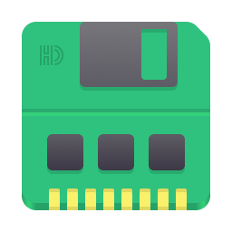

Tiny RAMDisk
============



What is a RAM Disk?
-------------------

RAM drive functionality can significantly benefit older computers with slow hard drive speeds. Hard Disk (HDD or SSD) read and write operations are moved to the Random Access Memory (RAM). Therefore depending on the particular computer hardware, user may experience up to 10x productivity boost. 

High file operation speeds are crucial when user puts heavy I/O on the filesystem. RAM disk not only provides better read and write speeds, but also takes the stress off the hard drive which increases its life expectancy.

Possible scenarios for the RAM disk can be:
* Working with large project in Integrated Development Environments (IDEs).
* Running computational analysis of numerous small size files.

Why Choose Tiny RAMDisk?
------------------------

Simplicity is often the key. Tiny RAMDisk has a minimal footprint on the system. Program consists from a few bash scripts and systemd service. Below please find some of the program features:

* **Persistent**. Files are saved back and restored from the hard drive each time user logs off. 
* **High speeds**. Data only resides in RAM (`ramfs`, not `tmpfs`) and will never end up on the `swap` partition.
* **Dynamic size**. RAM disk partition dynamically increases in size as more files are added.
* **Multi user**. Each user on the system can install and use his instance of RAM disk.

> [!IMPORTANT]
> User is responsible to keep track of the amount of data stored on the RAM disk. Ensure it does not exceed available RAM size. Otherwise system may have unpredictable behavior.

Prerequisites
--------------
Any GNU/Linux distribution with `systemd` suite and `PolicyKit` component.

How to Install
--------------

Prerequisites. Ensure that `rsync`, `systemd`, `notify-send` are installed on your computer (provided by default with most distributions). Next, open Terminal emulator and enter following commands:

```
git clone https://github.com/petrstepanov/tiny-ramdisk
cd ./tiny-ramdisk
chmod +x ./install.sh && install.sh
```

The RAM disk is mounted in the `RAMDisk` folder in home folder. On logout or restart files are saved in the hidden `~/.RAMDisk` folder.

> [!TIP]
> When working with a large amount of files on the RAM drive, it is reasonable to turn off your desktop environment indexing and search functionality on the RAM drive.

How to Uninstall
----------------

Execute following command inside the program folder:

```
chmod +x ./uninstall.sh && uninstall.sh
```

After uninstalling the RAM disk files are copied in the `~/.RAMDisk` home directory.
